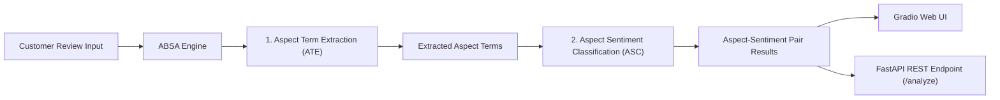
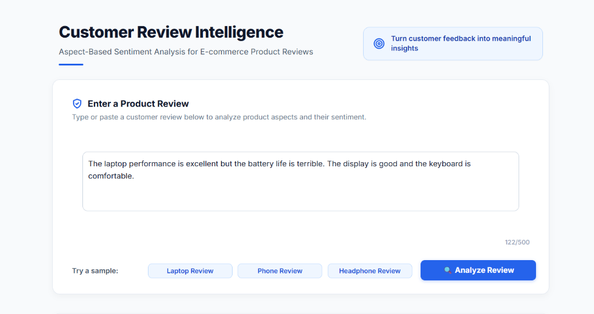
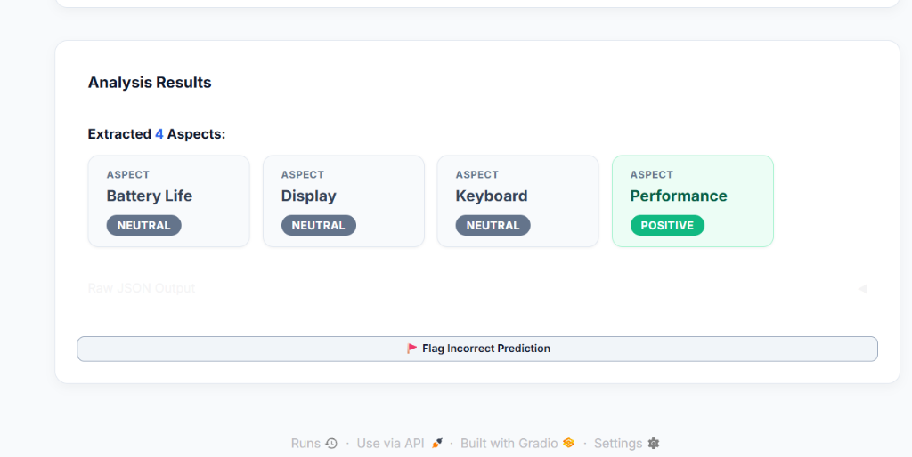

# Aspect-Based Sentiment Analysis (ABSA) for E-commerce Product Reviews

[](https://aspect-based-sentiment-analysis-for-e-gqf1.onrender.com)
[](https://www.python.org/)
[](https://fastapi.tiangolo.com/)
[](https://gradio.app/)
[](https://pytorch.org/)
[](https://huggingface.co/)
[](https://huggingface.co/yangheng/deberta-v3-base-absa-v1.1)
[](https://huggingface.co/google-bert/bert-base-uncased)
[](https://github.com/chakki-works/seqeval)
[](LICENSE)

An end-to-end **Aspect-Based Sentiment Analysis (ABSA)** web application and API for e-commerce customer feedback. Powered by **BERT** for Aspect Term Extraction (ATE), **DeBERTa-v3** for Aspect Sentiment Classification (ASC), and **Seqeval** for BIO-tagging evaluation, this project extracts specific product aspect terms (e.g. *screen*, *battery life*, *speakers*) from unstructured customer reviews and classifies the sentiment (*positive*, *negative*, *neutral*) specifically targeted at each aspect using PyTorch and Hugging Face Transformers.

---

## 🌐 Live Interactive Demo

Try the live deployed version directly in your browser without any setup:

👉 **[Launch Live Demo on Render](https://aspect-based-sentiment-analysis-for-e-gqf1.onrender.com)**

- **Interactive Web UI**: [https://aspect-based-sentiment-analysis-for-e-gqf1.onrender.com/](https://aspect-based-sentiment-analysis-for-e-gqf1.onrender.com/)
- **FastAPI Interactive Swagger Docs**: [https://aspect-based-sentiment-analysis-for-e-gqf1.onrender.com/docs](https://aspect-based-sentiment-analysis-for-e-gqf1.onrender.com/docs)

---

## Key Features

- **Aspect Term Extraction (ATE)**: Identifies target aspect words/phrases in unstructured review text.
- **Aspect Sentiment Classification (ASC)**: Evaluates sentiment polarity specifically targeted at each aspect.
- **Out-of-the-Box Execution**: Automatic model fallback ensures immediate execution upon cloning without requiring multi-gigabyte weight downloads upfront.
- **Modern Interactive Web UI**: High-contrast, user-friendly Gradio web application with sample buttons, live character counter (`0/500`), and prediction flagging for active learning.
- **FastAPI REST API**: High-performance backend API with automatic Swagger UI interactive documentation (`/docs`).
- **Modular Pipeline**: Clean, object-oriented design (`ABSAEngine`) with standalone training and evaluation scripts.

---

## System Architecture



---

## Technology Stack

### 1. Machine Learning & NLP Stack
- **[Python](https://www.python.org/)** (v3.9+) – Core programming language.
- **[PyTorch](https://pytorch.org/)** – Deep learning framework powering tensor operations, gradients, and neural network inference.
- **[Hugging Face Transformers](https://huggingface.co/docs/transformers/index)** – Pre-trained transformer architectures, pipelines, and model loaders.
- **[DeBERTa-v3](https://huggingface.co/yangheng/deberta-v3-base-absa-v1.1)** – Disentangled attention Transformer used for Aspect Sentiment Classification (ASC).
- **[BERT (bert-base-uncased)](https://huggingface.co/google-bert/bert-base-uncased)** – Bidirectional Transformer for Token Classification / Aspect Term Extraction (ATE).
- **[Hugging Face Datasets](https://huggingface.co/docs/datasets/index)** – Efficient dataset loading, mapping, and tokenization.
- **[Seqeval](https://github.com/chakki-works/seqeval) & [Evaluate](https://huggingface.co/docs/evaluate/index)** – Sequence labeling evaluation library for BIO-tagging F1 metrics.
- **[Scikit-learn](https://scikit-learn.org/)** – Machine learning evaluation metrics, classification reports, and score calculations.
- **[SentencePiece](https://github.com/google/sentencepiece) & [TikToken](https://github.com/openai/tiktoken)** – Sub-word tokenization algorithms.

### 2. Web Application & API Stack
- **[FastAPI](https://fastapi.tiangolo.com/)** – High-performance asynchronous backend REST API.
- **[Uvicorn](https://www.uvicorn.org/)** – Lightning-fast ASGI web server.
- **[Gradio](https://www.gradio.app/)** – Interactive web frontend for machine learning demos.
- **[Pydantic (v2)](https://docs.pydantic.dev/)** – Data validation, request/response models, and automatic Swagger OpenAPI documentation.

### 3. Data Processing & Utilities
- **[Pandas](https://pandas.pydata.org/)** – Dataframe manipulation and dataset cleaning.
- **[NumPy](https://numpy.org/)** – Numerical computing and matrix operations.
- **[KaggleHub](https://github.com/Kaggle/kagglehub)** – Automated dataset downloading and integration.
- **[Tqdm](https://github.com/tqdm/tqdm)** – Progress bar visualization for training loops.

### 4. Testing, Version Control & Deployment
- **[Pytest](https://docs.pytest.org/)** – Automated test framework for unit and integration testing.
- **[HTTPX / Requests](https://www.python-httpx.org/)** – HTTP clients for API request testing.
- **[Git & GitHub](https://github.com/)** – Version control and repository hosting.
- **[Render](https://render.com/)** – Cloud application deployment.

### Summary Table

| Category | Technology | Purpose |
| :--- | :--- | :--- |
| **Deep Learning** | PyTorch, Hugging Face Transformers | Neural network computation & pretrained models |
| **Models** | DeBERTa-v3, BERT-base | Aspect extraction (ATE) & sentiment classification (ASC) |
| **API Backend** | FastAPI, Uvicorn, Pydantic | Asynchronous REST endpoints & JSON validation |
| **Frontend UI** | Gradio | Interactive browser UI for live testing |
| **Data Processing** | Datasets, Pandas, NumPy | Data cleaning, tokenization, & array operations |
| **Evaluation** | Seqeval, Scikit-learn, Pytest | Token F1-score, accuracy, & unit tests |

---

## Repository Structure

```
├── assets/                   # Application screenshots and demo media
│   ├── ui_review_input.png
│   └── ui_analysis_results.png
├── demo.py                   # Gradio Web UI entrypoint (with live counter & flagging)
├── main.py                   # FastAPI REST backend server
├── requirements.txt          # Python dependencies
├── .gitignore                # Git exclusion rules
├── README.md                 # Project documentation
├── src/
│   ├── absa_engine.py        # Core ABSA Engine logic with fallback support
│   ├── dataset_loader.py     # Dataset download & preprocessing utility
│   ├── train_ate.py          # Aspect Term Extraction training script
│   └── train_asc.py          # Aspect Sentiment Classification training script
├── notebooks/                # Jupyter research & exploration notebooks
│   ├── exploration.ipynb
│   ├── preprocess.ipynb
│   ├── train_asc.ipynb
│   └── inference.ipynb
└── tests/
    └── test_absa.py          # Automated unit & endpoint tests
```

---

## 📸 Application Screenshots

### 1. Review Input & Real-Time Character Counter


### 2. Multi-Aspect Extraction & Sentiment Classification Results


---

## Quickstart Guide

### 1. Clone the Repository

```bash
git clone https://github.com/itsharshit7216/Aspect-Based-Sentiment-Analysis-for-E-commerce-Product-Reviews.git
cd Aspect-Based-Sentiment-Analysis-for-E-commerce-Product-Reviews
```

### 2. Install Dependencies

```bash
pip install -r requirements.txt
```

---

## Running the Interfaces

### A. Gradio Web Application UI

Launch the interactive web demo:

```bash
python demo.py
```

- **Access in your browser:** `http://localhost:7860`

---

### B. FastAPI REST API Backend

Start the FastAPI backend server:

```bash
python main.py
```
*Or using Uvicorn directly:*
```bash
uvicorn main:app --reload --host 127.0.0.1 --port 8000
```

- **Interactive Swagger Documentation:** `http://127.0.0.1:8000/docs`  
- **API Base URL:** `http://127.0.0.1:8000`

---

## API Usage & Endpoint Documentation

### `POST /analyze`

Analyze aspect sentiments in a review sentence.

#### Request Example (`cURL`):

```bash
curl -X 'POST' \
  'http://127.0.0.1:8000/analyze' \
  -H 'Content-Type: application/json' \
  -d '{
  "sentence": "The screen is bright but the speakers are disappointing."
}'
```

#### Response Example (`JSON`):

```json
{
  "sentence": "The screen is bright but the speakers are disappointing.",
  "analysis": {
    "screen": "positive",
    "speakers": "negative"
  },
  "extracted_aspects_count": 2
}
```

---

## Model Training

To train your own custom models locally:

1. **Prepare Data & Download SemEval Dataset**:
   ```bash
   python src/dataset_loader.py
   ```

2. **Train Aspect Term Extraction (ATE)**:
   ```bash
   python src/train_ate.py
   ```

3. **Train Aspect Sentiment Classification (ASC)**:
   ```bash
   python src/train_asc.py
   ```

Custom model checkpoints will be saved to `models/ate_model` and `models/asc_model` and automatically picked up by `ABSAEngine`.

---

## Running Automated Tests

Run the automated test suite to verify pipeline functionality:

```bash
pytest tests/test_absa.py
```

---

## License

This project is open-source and licensed under the [MIT License](LICENSE).
