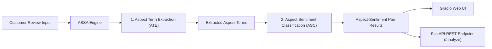
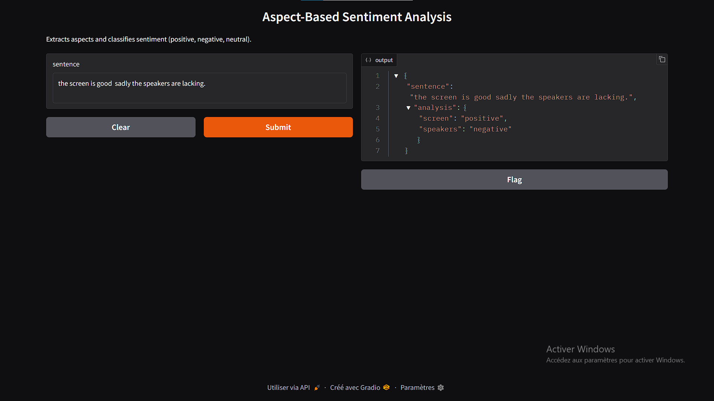

# Aspect-Based Sentiment Analysis (ABSA) on Product Reviews

[](https://www.python.org/)
[](https://fastapi.tiangolo.com/)
[](https://gradio.app/)
[](https://pytorch.org/)
[](https://huggingface.co/)
[](LICENSE)

An end-to-end **Aspect-Based Sentiment Analysis (ABSA)** web application and API. This project extracts specific product aspect terms (e.g. *screen*, *battery life*, *speakers*) from customer review text and classifies the sentiment (*positive*, *negative*, *neutral*) for each extracted aspect using PyTorch and Hugging Face Transformers.

---

## Key Features

- **Aspect Term Extraction (ATE)**: Identifies target aspect words/phrases in unstructured review text.
- **Aspect Sentiment Classification (ASC)**: Evaluates sentiment polarity specifically targeted at each aspect.
- **Out-of-the-Box Execution**: Automatic model fallback ensures immediate execution upon cloning without requiring multi-gigabyte weight downloads upfront.
- **Gradio Interactive Web UI**: User-friendly web application for testing review sentences visually.
- **FastAPI REST API**: High-performance backend API with automatic Swagger UI interactive documentation (`/docs`).
- **Modular Pipeline**: Clean, object-oriented design (`ABSAEngine`) with standalone training and evaluation scripts.

---

## System Architecture



---

## Repository Structure

```
├── demo.py                   # Gradio Web UI entrypoint
├── main.py                   # FastAPI REST backend server
├── requirements.txt          # Python dependencies
├── .gitignore                # Git exclusion rules
├── README.md                 # Project documentation
├── screenGradioDemo.png      # Web interface screenshot
├── src/
│   ├── absa_engine.py        # Core ABSA Engine logic with fallback support
│   ├── dataset_loader.py     # Dataset download & preprocessing utility
│   ├── train_ate.py          # Aspect Term Extraction training script
│   └── train_asc.py          # Aspect Sentiment Classification training script
├── notebooks/                # Jupyter research & exploration notebooks
│   ├── exploration.ipynb
│   ├── preprocess.ipynb
│   ├── train_asc.ipynb
│   └── inference.ipynb
└── tests/
    └── test_absa.py          # Automated unit & endpoint tests
```

---

## Quickstart Guide

### 1. Clone the Repository

```bash
git clone https://github.com/YOUR_USERNAME/Aspect-Based-Sentiment-Analysis-on-Product-Reviews.git
cd Aspect-Based-Sentiment-Analysis-on-Product-Reviews
```

### 2. Install Dependencies

```bash
pip install -r requirements.txt
```

---

## Running the Interfaces

### A. Gradio Web Application UI

Launch the interactive web demo:

```bash
python demo.py
```

- **Access in your browser:** `http://localhost:7860`



---

### B. FastAPI REST API Backend

Start the FastAPI backend server:

```bash
python main.py
```
*Or using Uvicorn directly:*
```bash
uvicorn main:app --reload --host 127.0.0.1 --port 8000
```

- **Interactive Swagger Documentation:** `http://127.0.0.1:8000/docs`  
- **API Base URL:** `http://127.0.0.1:8000`

---

## API Usage & Endpoint Documentation

### `POST /analyze`

Analyze aspect sentiments in a review sentence.

#### Request Example (`cURL`):

```bash
curl -X 'POST' \
  'http://127.0.0.1:8000/analyze' \
  -H 'Content-Type: application/json' \
  -d '{
  "sentence": "The screen is bright but the speakers are disappointing."
}'
```

#### Response Example (`JSON`):

```json
{
  "sentence": "The screen is bright but the speakers are disappointing.",
  "analysis": {
    "screen": "positive",
    "speakers": "negative"
  },
  "extracted_aspects_count": 2
}
```

---

## Model Training

To train your own custom models locally:

1. **Prepare Data & Download SemEval Dataset**:
   ```bash
   python src/dataset_loader.py
   ```

2. **Train Aspect Term Extraction (ATE)**:
   ```bash
   python src/train_ate.py
   ```

3. **Train Aspect Sentiment Classification (ASC)**:
   ```bash
   python src/train_asc.py
   ```

Custom model checkpoints will be saved to `models/ate_model` and `models/asc_model` and automatically picked up by `ABSAEngine`.

---

## Running Automated Tests

Run the automated test suite to verify pipeline functionality:

```bash
pytest tests/test_absa.py
```

---

## License

This project is open-source and licensed under the [MIT License](LICENSE).
